# Installing VS Code

To get started you will want to use a code editor. For what it's worth you may use your text editor of choice, but for this tutorial I will be using VS Code. 

To download VS Code you will want to navigate to the website and download it for your OS.

[VS Code Website Link](https://code.visualstudio.com/)

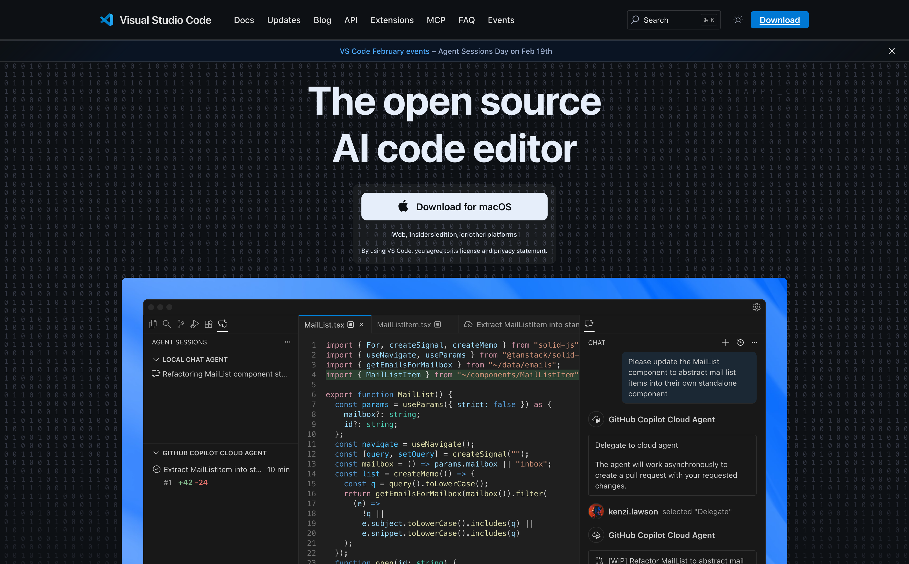

---

# Installing Python
We will be using the latest version stable version of Python which is `3.14`. *Note! Some of the Python dependencies I will be using will not work with version `3.15`.*

[Python Website Link](https://www.python.org/)

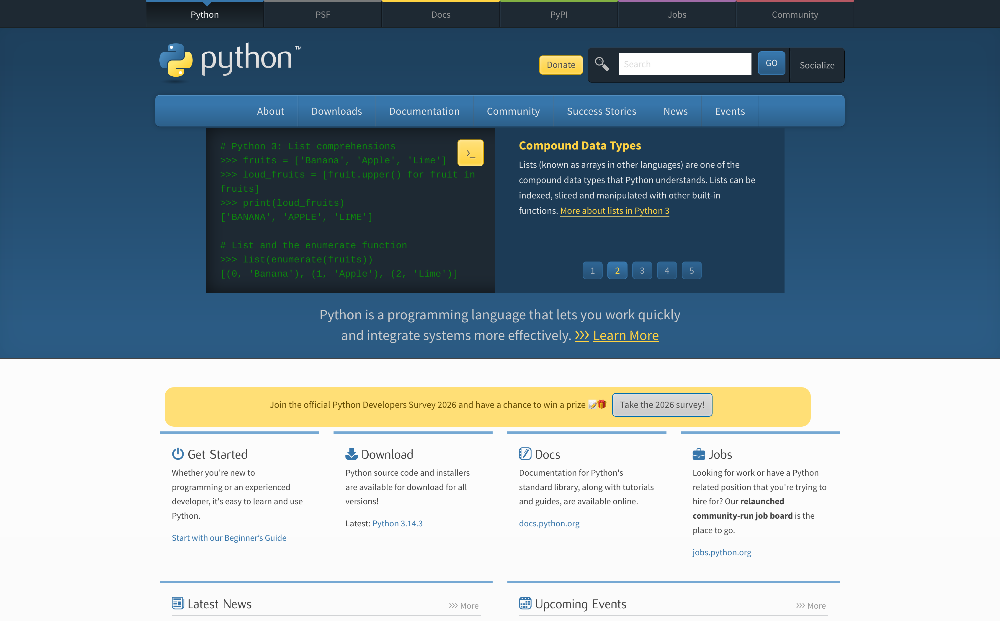


Make sure to navigate the Python website to download `3.14` again for your OS.

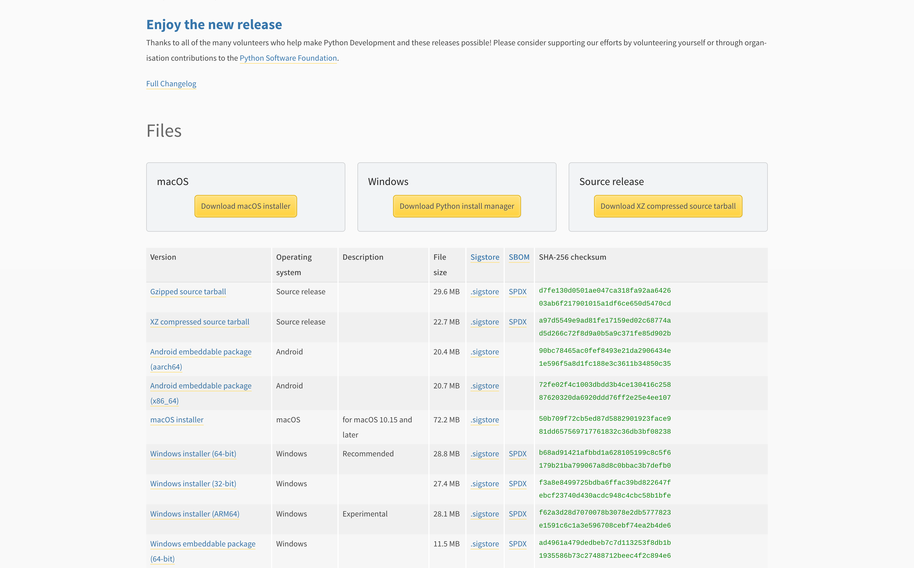

::: {.callout-warning}

Make sure if you are on Windows or Mac and you are using the installer you check off the `Add to PATH` option in the install software.

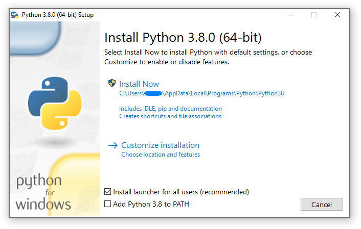
:::


## Creating a Virtual Environment

***Why use a Virtual Enviroment?***

While it is not necessary that you create a virtual environment, as you do more projects (either with Data Science or not) it is helpful to separate all your tools. Or if you work on a project it may not work in the future if the dependency is updated. So it is best practice to separate all of your python projects with their own virtual environment.


To create a virtual environment open up your terminal and create a folder for this project.


::: {.callout-tip}
*I chose my default Documents directory and created a folder called `quarto-files`*

The part highlighted in ***yellow*** can be changed for anything but prefix it with a `.`.

It is best if you name this something that makes sense, the default name is `.venv` but `.quarto-venv` is another good option!
:::

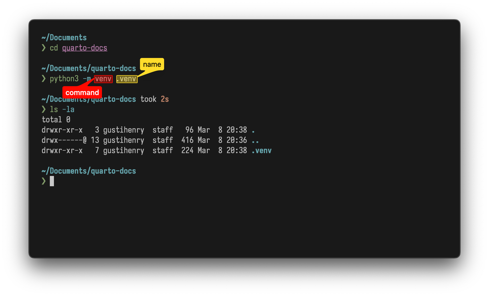

Above you can see if you type the command `ls -la` that a new hidden folder appeared `.venv` or the name of your dependency. The dot in front of the name means that it is a hidden folder that you cannot see. Which for this case is fine! You do not need to edit any of the files in this folder.

## Activating and Deactivating Your Virtual Enviroment

To activate your virtual environment run the command in the screenshot below:

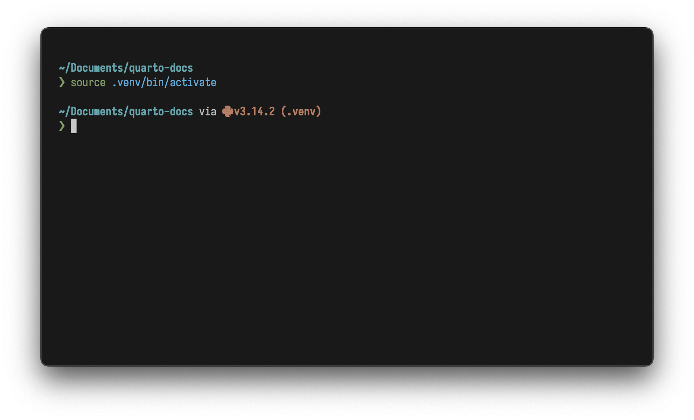

::: {.callout-warning}
If you are on ***Windows*** type `source .venv/bin/Activate.psh`
:::

From here you can navigate your directory and interface with your python projects like normal. 

::: {.callout-tip}
## Gusti's Analogy

Imagine you have a bunch of backpacks, and each backpack is a virtual environment. By typing the activate command that puts the backpack of your choice and you can take it anywhere and `deactivate` lets you remove that backpack.

:::

## Installing Dependencies

Depending on your OS copy and paste this command into your terminal to install the dependencies. Further below I will write a quick summary for what each does.

::: {.panel-tabset}

## Mac

```console
python3 -m pip install jupyter matplotlib plotly pandas numpy
```
## Windows

```console
py -m pip install jupyter matplotlib plotly pandas numpy
```
:::


| Library            | R Equivlent           | Explaination                                                      |
|--------------------|-----------------------|-------------------------------------------------------------------|
| jupyter notebooks   | R Studio, R Markdown  | Allows you to create blocks of executable code between plain text |
| matplotlib /plotly | base R plots, ggplot2 | Create charts in python                                           |
| pandas             | base R, dplyr         | transform, manipulate, and manage  large amounts of data          |
| numpy              | base R                | expanded python maths library                                     |


::: {.callout-important}
At this point if you have run into any errors here are a couple suggestions.

- Make sure your Python version is 3.14
- Your python virtual environment is activated
- Check installations of python dependencies for errors.
:::

--- 

# Quarto & VS Code

From this point we can do most/all of our work in VS Code. But the principles should be the same for whatever method that you choose.

**Open up VS Code** and navigate to your *Activity Panel* on the left to open up your Extensions Tab.

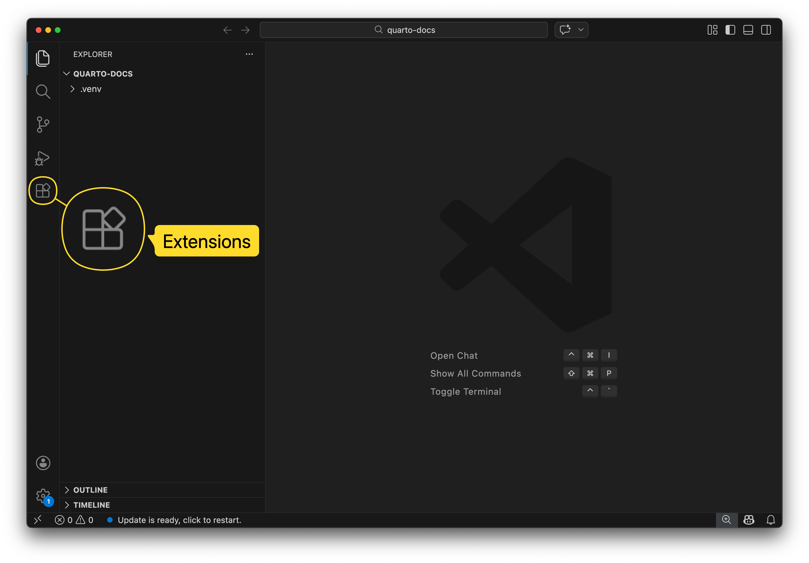

From there **install** the `Quarto` and `Python` extensions.

::: {#fig-extensions layout-ncol=2}

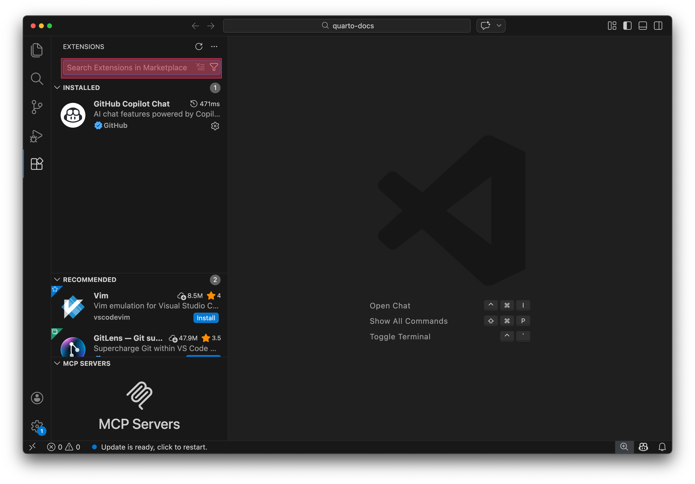

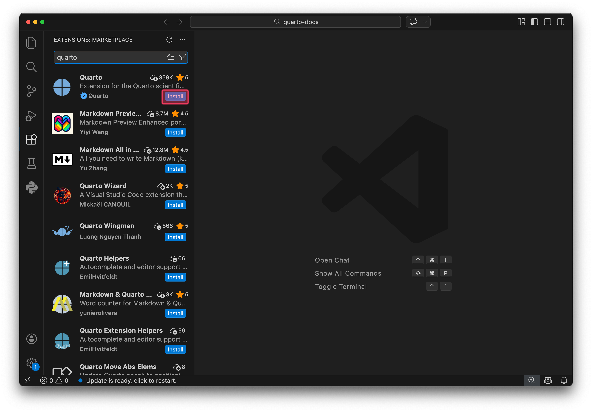

:::


Once you have installed those extensions create a new file with the extension of `.qmd`
::: {.content-visible when-format="html"}


:::

::: {.content-visible when-format="pdf"}
 *** Hello This is a placeholder that took me 2 hours to fix. There is supposed to be a gif here but I couldn't get it for pdf documents. Please view the final HTML Page at the bottom of my pdf to view this gif. Thanks!
:::

## Setting up Quarto Document

These following code blocks can be copy and pasted into Quarto. Also, I am making this document you are reading right now with Quarto! At the end of this tutorial I will share my quarto document so you can see what it looks like!

**Creating a Code Block**

Now this is getting a little meta! Below is a screenshot of what a quarto code block looks like.

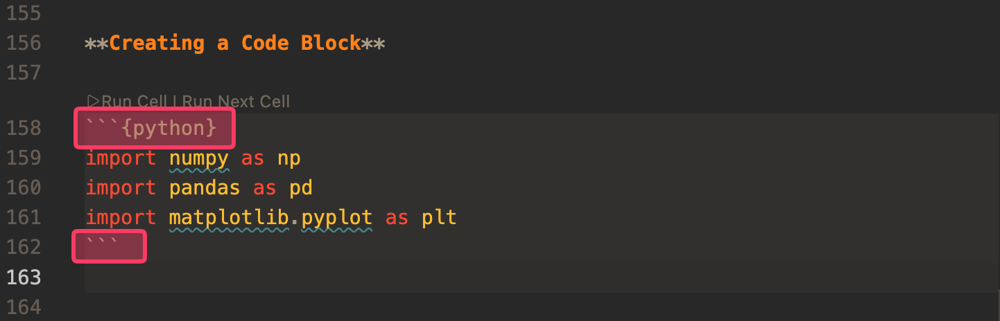

```{python}
import numpy as np
import pandas as pd
import matplotlib.pyplot as plt
```

Finally we get to the coding! Each block I have shown below I have in a separate code block shown in the screenshot above. ***Quarto*** tracks your variables across blocks and acts just like a regular `python` document, but with text in between.

Copy my header and basic layout from the screenshot below to give a basic scaffolding to build upon. 

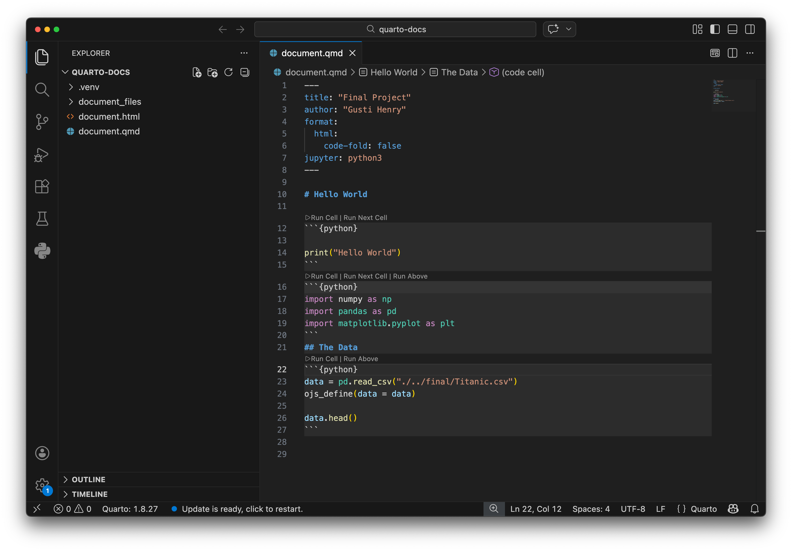

::: {.callout-note}
If you want more information to change the looks or exporting to a PDF Document! Make sure to visit the [Quarto Documentation](https://quarto.org/docs/guide/).
:::

## Loading Data in Pandas

```{python}
data = pd.read_csv("Titanic.csv")
ojs_define(data = data)

data.head()
```

Here we can use the function `data.head()` on our variable `data`. This acts the same way as `head(data)` in R. And also call `pd.read_csv()` which is a `pandas` function to read our data.

::: {.callout-note}
I have *Titanic.csv* in the same folder as my quarto document to keep it simple. Make sure to reference it like reading a csv in R if your data is in another folder.
:::

## Viewing Your Quarto Document 

To view your Quarto Document navigate to your directory via your terminal and run the following command:

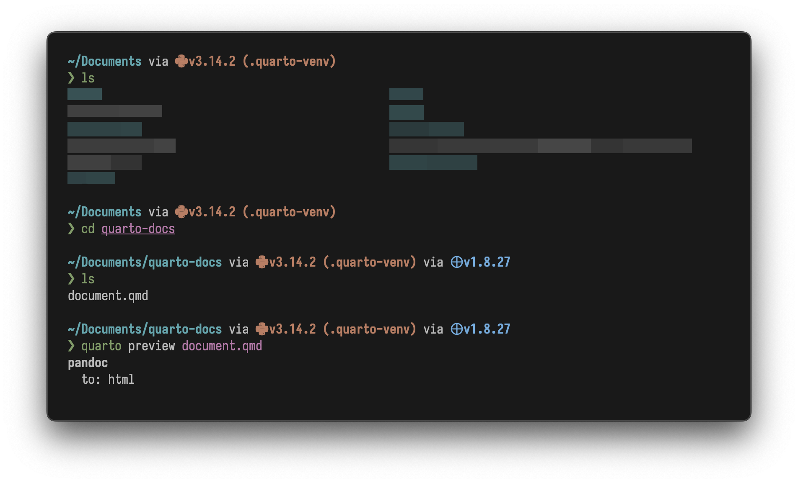

Quarto will then open your default browser with an HTML view of your current document. It also refreshes when you save the document.

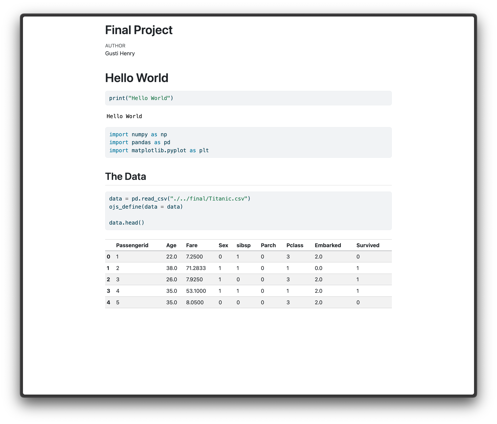

::: {.callout-warning}
Make sure you still have your python virtual environment running or else it will ask that you install dependencies.
:::

## Basic Data Manipulation with Pandas

Now that we can view our outputs and have our data. Lets create a subset of the titanic dataset that will be easier to make charts with.

```{python}
data.head()
```

```{python}
# Group the Dataframe by passenger class
grouped = data.groupby('Pclass')

# Get the 'Age' column from each group
age_col = grouped['Age']

# Find the Mean Ages
mean_ages = age_col.mean()

# Change Name of Columns

# Reset Index (I do this out of habit and it is just good practice to flatten your new data-frames)
avg_age_by_class = mean_ages.reset_index()
avg_age_by_class.columns = ['Class', 'Average Age']


avg_age_by_class
```

Now lets use this data to create a simple bar chart with `d3.js`

# D3.js

D3.js is a javascript vector library at it's core. What does that mean? Basically it allows you to create HTML objects that can be resized according to data. It is very bare-bones and low-level (don't think low-level programming language). At times this can be very frustrating because it means making a simple bar chart is very complicated. 

But, D3.js shines in very complicated, unique, and interactive visualizations.

Because we are now working within javascript you will want to create a new code-block like we have done before. But instead of creating a `python` labeled code block, we will be naming it `ojs`. This basically allows us to run javascript right in our quarto document.

```{ojs}
d3 = require("d3@7")
```

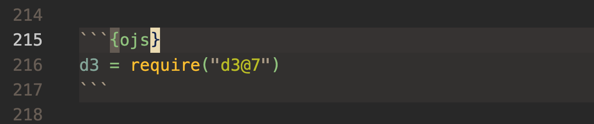

## Connecting our Python Data and Javascript Data

Since Python and Javascript are two different programming languages, we have to let Quarto know that we would like to pass data between the two of them. Luckily, Quarto does the heavy lifting.

Write the following code in a `python` code block.

```{python}
ojs_define(avg_age_by_class = avg_age_by_class.to_dict(orient="records"))
```

`ojs_define` is a method provided by quarto and it is available for `python` and `r`. Essentially it allows you to package your data to then send to your `ojs` code to unpack.

~~~markdown
```ojs
transpose(avg_age_by_class)
```
~~~


## Creating a Simple Bar Chart

There are two methods to creating a bar chart. One that uses the `Observable JS` API which lets us create bar charts quickly using D3.js. The other is making one from scratch using the `d3.js` API. Let's start simple with the `Observable.js` API.

Find more information about the `Observable.js` API from their [docs](https://observablehq.com/plot/marks/bar).

**Observable.js**

```{ojs}
ojsAPITitanicBarChart = Plot.barY(
  avg_age_by_class, {x: "Class", y: "Average Age", fill: "steelblue"}
)
ojsAPITitanicBarChart.plot({
  color: {
    scheme: "tableau10"
  }
})
```


**Base D3.js**

This will be a *bit* more complicated so I have added comments to my code to hopefully break it all down.

::: {.callout-tip}
Think of d3.js as creating a plot from scratch, literally, measuring a piece of paper, gluing it, etc. etc. It will help you think about all the parts you need.
:::

**1. Creating SVG Canvas**

```ojs

const svg = d3.create('svg')
  .attr("width", 500)
  .attr("height", 320);

```

d3 creates an `svg` element in memory and `.attr()` sets the size of the svg.

**2. Margins**

```ojs

const margin = { top: 20, right: 30, bottom: 50, left: 60 };
const innerWidth  = width  - margin.left - margin.right;
const innerHeight = height - margin.top  - margin.bottom;

const g = svg.append('g')
  .attr("transform", `translate(${margin.left}, ${margin.top})`)

```

Creates margins, this can be *fiddly* don't be afraid to bust out the calculator to do a bit of math if you have to.

**3. X Scale**

```ojs

const x = d3.scaleBand()
  .domain(DataTransfer.map(d => "Class " + d.Class))
  .range([0, innerWidth])
  .padding(0.3);

```

Remember when you were sitting in your statistics class in high school and they were teaching you about domain and range, and you thought it would never matter! Well now it does. `scaleBand` is used for categorical data like `pClass` (we changed it to `Class`) and takes a list of categories (`domain`) and divides the width of `range` across them. I added padding as well.

::: {.callout.tip}
If you are really into d3.js if you call `x("Class 1") it will return the pixel position of that bar.
:::

**4. Y Scale**

```ojs

const y = d3.scaleLinear()
  .domain([0, 45])
  .range([innerHeight, 0])

```

`scaleLinear` maps a number range to pixels. In this case it is 0 - 45.

**5. Data Joining**

```ojs

g.selectAll("rect")
  .data(avg_age_by_class)
  .join("rect")

```

This is a very important concept in D3. Let's break it down:

- `selectAll("rect")` gets all existing `<rect>` HTML elements, we don't have any yet.
- `.data(avg_age_by_class)` binds our Titanic data to that selection of `<rects>`
- `.join("rect")` for each point of data d3 creates a `<rect>`. 


```ojs

  .attr("x", d => x(.d.class))
  .attr("y", d => y(d.age))
  .attr("width", x.bandwidth())
  .attr("height", d => innerHeight - y(d.age))

```

Now we begin mapping our attributes (`.attr()`) to our data rects. 
- `x` is our left edge of each bar which we use our x scale to get a pixel position.

- `y` is our top edge - which uses our y scale
- `width` is set to `x.bandwidth()` which we calculated from `scaleBand()` in Step 3
- `height` is `innerHeight - y(d.age)` which is the distance from the top of the bar to the baseline.

**6. Axes**

```ojs

g.append("g")
  .attrr("transform", `translate(0, ${innerHeight})` )
  .call(d3.axisBottom(x))
  .call(a => a.select(".domain").remove())

```


- `d3.axisBottom(x)` creates an axis generator using your `x` scale which knows our inputs.

- `.call()` passes the `<g>` element into the axis generator, which renders ticks and labels into it. 

-`.select(".domain").remove()` deletes the baseline axis because I like things to look nice! 

## The Chart

Quarto has some troubles breaking down multiple js chucks so it is best to just create your charts in one block.


```{ojs}
chart = {
  const width = 1000, height = 520;
  const margin = { top: 20, right: 30, bottom: 50, left: 60 };
  const innerWidth  = width  - margin.left - margin.right;
  const innerHeight = height - margin.top  - margin.bottom;

  const svg = d3.create("svg")
    .attr("width", width)
    .attr("height", height);

  const g = svg.append("g")
    .attr("transform", `translate(${margin.left},${margin.top})`);

  const x = d3.scaleBand()
    .domain(avg_age_by_class.map(d => "Class " + d.Class))
    .range([0, innerWidth])
    .padding(0.3);

  const y = d3.scaleLinear()
    .domain([0, 45])
    .range([innerHeight, 0]);

  g.append("g")
    .attr("stroke", "#e0e0e0")
    .attr("stroke-dasharray", "4,2")
    .selectAll("line")
    .data(y.ticks(5))
    .join("line")
      .attr("x1", 0).attr("x2", innerWidth)
      .attr("y1", d => y(d))
      .attr("y2", d => y(d));

  g.selectAll("rect")
    .data(avg_age_by_class)
    .join("rect")
    .attr("x",      d => x("Class " + d.Class))
    .attr("y",      d => y(d["Average Age"]))
    .attr("width",  x.bandwidth())
    .attr("height", d => innerHeight - y(d["Average Age"]))
    .attr("fill", "steelblue")
    .attr("rx", 4);

  g.selectAll("text.label")
    .data(avg_age_by_class)
    .join("text")
    .attr("x", d => x("Class " + d.Class) + x.bandwidth() / 2)
    .attr("y", d => y(d["Average Age"]) - 8)
    .attr("text-anchor", "middle")
    .attr("font-size", "13px")
    .attr("fill", "#333")
    .text(d => d["Average Age"]);

  g.append("g")
    .attr("transform", `translate(0,${innerHeight})`)
    .call(d3.axisBottom(x))
    .call(a => a.select(".domain").remove());

  g.append("g")
    .call(d3.axisLeft(y).ticks(5))
    .call(a => a.select(".domain").remove());

  svg.append("text")
    .attr("transform", "rotate(-90)")
    .attr("x", -(height / 2))
    .attr("y", 16)
    .attr("text-anchor", "middle")
    .attr("font-size", "12px")
    .attr("fill", "#666")
    .text("Average Age");

  return svg.node();
}

chart
```

*Since I will be uploading my quarto document as well feel free to mess around with these values to change the chart. I added some extra nice things because I can't stand to look at ugly charts!!*

# Publishing to Github Pages

Finally in order to show your work to the world online you will want to create a [Github Pages](https://docs.github.com/en/pages) website.

For this step I ***highly*** ***highly*** recommend following the Github Pages QuickStart documentation. But, essentially you will want to create a new empty Github repo with the name of `{your-github-usename}.github.io` and create another separate repo for this project folder. Along with that Quarto also has a [Quickstart Guide](https://quarto.org/docs/publishing/github-pages.html)


## Final View!

Here is the final website! 
[This Document but HTML!](https://theloosygoose.github.io/quarto-howto/26-03-04-henry-gusti-final.html)

Hopefully d3.js doesn't come off as too scary. At first it was like that for me as well. Even for this project I didn't really understand the ins and outs of things but since completing this I have gotten a lot better, and with time so will you! Ciao!

- Gusti Rama Henry